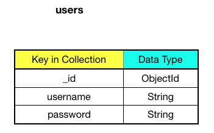

## Table of Contents
[Project Goal](#project-goal)

[User Experience](#user-experience)
- [User Goal](#user-goal)
- [Users Stories](#users-stories)
- [Designer Strategy](#designer-strategy)
- [Design Elements](#design-elements)
- [Wireframes](#wireframes)

- [Features](#features)
    - [Features to be implemented in the future](#features-to-be-implemented-in-the-future)

- [Technologies used](#technologies-used)
    - [Other tools used to build the project](#other-tools-used-to-build-the-project)

- [Testing](#testing)

- [Project deployment](#project-deployment)
    - [Local deployment](#local-deployment)
    - [Heroku deployment](#deploying-an-app-to-heroku)

- [Project database structure](#project-database-structure)

- [Credits](#credits) 
    - [Contents](#content)
    - [Media](#media)
    - [Inspiration and motivation](#inspiration-and-motivation)
    - [Acknowledgements](#acknowledgements)

- [Disclaimer](#disclaimer)

## Project Goal
The main goal for creating this website is to deliver interesting information about different type of guitars. This website 
is not only recommended for guitarists who would like to add their favourite guitars, but to any website user who 
would like to gain more knowledge about this fantastic instrument. 

[Back to top](#table-of-contents)

## User Experience
### User Goals
- I want the website to work properly on different type of devices such mobile phones, tablets, ipads and
  desktops
- I want to have an easy access to dashboard where I can see the guitar I added
- I want the website which is simple to use and where I can easily update information 

### User Stories
- as a User, I want to find the website easy to use and navigate
- as a User, I want to find the website content approachable and not overwhelming
- as a User, I want to access the information about the guitars easily
- as a User, I want to have an ability to register and log in with no obstacles
- as a User, I want to be easily redirected to external guitar shops websites 
- as a User, I want to be able to visit social-media sites provided by the website host
- as a User, I want to be log out successfully
- as a User, I want to be able to add, edit and delete guitar's details

[Back to top](#table-of-contents)

### Designer's Strategy
- to create a website which will be a user-friendly and easy to navigate;

- to deliver a website with easy to read, informative, concise text which will play a major role in search engine placement;

- to create a website which engages its users and continues to hold their attention when they browse through it;

- to provide a simple information accessibility and place key information in a plain manner, so the users can only locate  
 a certain bit of info i.e. register form, social-media links, etc., without perusing the entire site;

- to create a website which will be intuitive and would anticipate the users' needs;

### Design Elements
Being aware of how important it is to built a website which would reflect designer's idea, I decided to use a nice colours pallete
and fonts. My goal was to mix both simplicity and elegance at the same time. I believed it would build a nice connection between 
the users and the website host.

#### Logo 
[Logo Maker](https://www.freelogodesign.org/) has been used to create a **guitar** related logo. Logo is located in the navbar on the right side.
Once clicked it redirects the user to **About Us** page.

[Back to top](#table-of-contents)

#### Fonts
I decided to use two type of [Google Fonts](https://fonts.google.com/):

- **Special Elite** 

- **Spartan** 

#### Colours
I have generated a colour pallete using [Materialize](https://materializecss.com/color.html) to create a visually positive experience for the users.
I opted for calm colours as I did not want to distract the user from the website content by applying overwhelming colour pallete.

[Back to top](#table-of-contents)

### Wireframes
I used [Balsamiq](https://balsamiq.com/) software to create the wireframes. The wireframes allowed me to carefully plan what I wanted to achieve, and
what would be a final effect of the written code. 

The wireframes can be found [here](https://github.com/KrisK1978/buzzing-strings/tree/master/wireframes).

## Features

### Features Visible to All Users

#### About Us

The following content will be seen by the user in this section:

- a welcoming text 

- an invitation to visit **All Guitars** (redirects new user to Sign Up/Register page) or redirect to **Log In** page

- an opportunity to check guitar shops recommended by the website host

#### Log In

This option only allows already registered user to **Log In**. A warning text will display if the user submits a wrong username and/or
password.

#### Sign Up!

This section allows to register and use the available options on the website. Once registered, the new user would be able to view 
a list of guitars, add a new guitar, update or delete the information. Sign up procedure only allows to register a username which does not 
exist in a database already. There is also a requirement for a specific number of characters to be used when registering new user. 

#### Log Out 

This option allows the user to successfully log out from the page. 

#### Footer

[Back to top](#table-of-contents)

Basic footer with a copyright text and **Social Links** icons. Once the user clicks on **GitHub** icon it redirects to website host's 
acccount where other projects can be viewed. Other two icons are disabled and will not redirect the user to external websites. 

### Features Visible Only to Registered Users

#### All Guitars 

This section is only available to existing users. It displays a list of different type of guitars (classical, electric and bass) and also 
provides detailed guitar description. If there are no guitars to display, the user can use a link provided which will redirect to **Add Guitar** page.
The user would also have an opportunity to update already existing content, using **Edit** button, and be able to remove it completely by using
**Delete** button (this action cannot be reversed). 

#### Add Guitar 

This option allows the registered/logged user to add a favourite guitar with a description. The user is required to fill in all fields in the form 
provided before **Add Your Guitar** button is used.  No form can be submitted if there is a missing information. 

### Features to be implemented in the future

The following features might be applied to the website in the future:

1. **Pagination**

2. **Adding tutorial videos of how to learn basic guitar chords**

3. **Adding simple users chat functionality**

4. **Creating a user's list of favourite guitars**

[Back to top](#table-of-contents)

## Technologies used

### Languages

1. **HTML**

2. **CSS**

3. **JavaScript**

4. **JSON**

5. **Python**

[Back to top](#table-of-contents)

### Other tools used to build the project

1. [GitHub](https://github.com/)

2. [MongoDB Atlas](https://www.mongodb.com/)

3. [Heroku](https://www.heroku.com/)

4. [Flask](https://flask.palletsprojects.com/en/1.1.x/)

5. [Jinja](https://jinja.palletsprojects.com/en/2.11.x/)

6. [PyMongo](https://pymongo.readthedocs.io/en/stable/index.html)

7. [jQuery](https://jquery.com/)

8. [Werkzeug](https://werkzeug.palletsprojects.com/en/1.0.x/)

9. [Materialize](https://materializecss.com/)

10. [Font Awesome](https://fontawesome.com/icons?d=gallery)

11. [Google Fonts](https://fonts.google.com/)

12. [Favicon](https://www.favicon-generator.org/)

13. [Unicorn Revealer](https://chrome.google.com/webstore/detail/unicorn-revealer/lmlkphhdlngaicolpmaakfmhplagoaln?hl=en-GB)

14. [Am I Responsive?](http://ami.responsivedesign.is/)

15. [Find Unclosed Tags](https://www.aliciaramirez.com/closing-tags-checker/)

16. [Autoprefixer CSS](https://autoprefixer.github.io/)

17. [RandomKeygen](https://randomkeygen.com/)

18. [Free Logo Design](https://www.freelogodesign.org/)

19. [PicResize](https://picresize.com/)

20. [Balsamiq](https://balsamiq.com/)

21. [PEP8](http://pep8online.com/)

22. [JSHint](https://jshint.com/)

23. [Markup Validation Service](https://validator.w3.org/)

24. [CSS Validation Service](https://jigsaw.w3.org/css-validator/)

## Testing
The project testing details can be found [here](https://github.com/KrisK1978/buzzing-strings/blob/master/TESTING.md).

[Back to top](#table-of-contents)

## Project deployment 
This project was built on [GitPod](https://www.gitpod.io/). [GitHub](https://github.com/login) was used to host the repository.

Make sure you have the following tools installed to make the deployment successful:

- **PIP**
- **Python3**
- **IDE** (pick the most suitable for you)
- **MongoDB Atlas** account

### Local deployment
The following steps need to be used to clone the project from **GitHub**:

1. Follow the link to the [project-repository](https://github.com/KrisK1978/buzzing-strings).

2. Go to **Code** tab and use **Clone** to copy the URL `https://github.com/KrisK1978/buzzing-strings.git`
   from **Clone** with **HTTPs** for the repository.

3. Go to your local **IDE** and open a new command line - terminal.

4. Type in `git clone` in your terminal.

**IMPORTANT:**

Please check the instructions for operating in your virtual environment as they can vary depending on what type
operating system is being used. The **Python Documentation** can be found [here](https://docs.python.org/3/library/venv.html).

5. Create a file called `.flaskenv` and add the following items:
    -    *FLASK_APP=run.py*
    -    *FLASK_ENV=development*

6. Install the required dependencies from **requirements.txt** file using the command below:
    - `pip3 -r requirements.txt`

7. Register a new account on [MongoDB Atlas](https://www.mongodb.com/cloud/atlas/register) 
   and create a new database called **buzzing_strings** and set up the required **Collections** for 

8. In your **IDE** create a file where you can store the following information:

    - `IP`
    - `PORT`
    - `MONGO_DBNAME`
    - `MONGO_URI`
    - `SECRET_KEY`

9. Run an application using either `python3 app.py` or `flask run` command:

[Back to top](#table-of-contents)

### Deploying an app to Heroku 
Use the following steps to deploy [buzzing-strings](https://buzzing-strings.herokuapp.com/) to Heroku:

1. Create a **requirements.txt** file using the command below:

    `pip3 freeze --local > requirements.txt`

2. Create a **Procfile** file using the following command:

    `echoweb: python app.py > Procfile`

    - *make sure it is a capital P and there is no file extension added*
    - *open a Procfile file and remove a blank line as if left it can cause problems with an app*

3. Push new created files to **GitHub** repository.
4. Go to [Heroku](https://id.heroku.com/login) and create a new app for this project using **Heroku Dashboard**.
5. Remember to give your app a unique name and set up a region.
6. In **Deployment** tab go to **Deployment Method** and click on **GitHub** icon to connect an app. Type in 
   *repository name* and hit *search*. Once repository is found click **Connect**.
7. Go to **Settings** tab and open **Config Vars**. Add the following information:

    |   **Key**         |                             **Value**                                                       |
    | ----------------- | ------------------------------------------------------------------------------------------- |                        
    |       IP          |                              0.0.0.0                                                        |
    |      PORT         |                              5000                                                           |
    |   MONGO_DBNAME    |                         'database name'                                                     |
    |    MONGO_URI      | mongodb+srv://:@<cluster_name>-qtxun.mongodb.net/<database_name>?retryWrites=true&w=majority|           
    |   SECRET_KEY      |                           'secret_key'                                                      |

8. Go back to **Deploy** tab and scroll down to find **Automatic Deploys**. Click on **Enable Automatic Deployment**.
9. Remember to click **Deploy Branch** as we have only one branch for this project. **Heroku** will receive the code from
   **GitHub**. When new changes are pushed to **GitHub** next time, our app content should be updated accordingly. 

[Back to top](#table-of-contents)

## Project database structure

Using the features **MongoDB Atlas** provides, I was able to create the following collections:

1. **Guitar Categories**

    

2. **Guitars** 

    

3. **Users**

    

[Back to top](#table-of-contents)

## Credits 

### Contents
The content of the website was written by me. 

### Media 
I used the following media platforms to complete this project:

- [Guitar Guitar](https://www.guitarguitar.co.uk/)

- [Kenny's Music](https://www.kennysmusic.co.uk/)

- [Gear4Music](www.gear4music.com)

- [Traversy Media](https://www.traversymedia.com/)

### Inspiration and motivation 
[Guitar Guitar](https://www.guitarguitar.co.uk/) and my friend Dawid, a fantastic guitarist, was my main inspration to build [buzzing-strings]() website. 
I have always considered a guitar as one the most magical instruments in music history. I had a great opportunity to 
see some fantastic guitarists in my life and was able to admire how a sound connection can be built between an instrument and a human.
My motivation was not only to highlight the fact how great this instrument is but also to give an opportunity to the website users to share
their thoughts about their favourite guitars. I was also motivated to deliver some interesting facts/information to users who never played a guitar,
but would like to gain some knowledge about this instrument. 

### Acknowledgements
This project would not be completed without a great support of my family and friends and my mentor [Simen Daehlin](https://github.com/Eventyret).
Their constructive advice delivered valid and well-reasoned opinions. It involved both positive and negative comments which helped 
me to see my project from a different perspective and amend the content to achieve the ultimate goal, a user-friendly and
interesting website. 

Also, I would like to thank my fellow [Code Institute](https://codeinstitute.net/) students and tutors who always been there for me, 
offering a friendly advice when I was having problems with sorting things out. Last but not least [Slack](https://slack.com/signin#/signin) 
community which I found extremely helpful in resolving code-related issues. 

### Disclaimer  
This website was created for educational purpose only.

[Back to top](#table-of-contents)